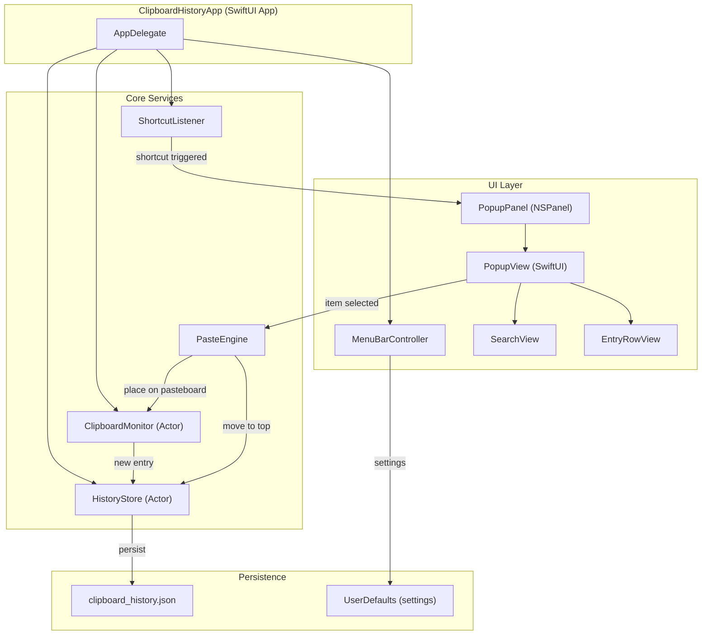

# Design Document

## Overview

This document describes the technical design for a macOS clipboard history manager built with Swift and SwiftUI. The application runs as a menu bar utility (no Dock icon) that monitors the system pasteboard via polling, persists clipboard entries to disk as JSON, and presents a popup panel overlay triggered by a global keyboard shortcut. The user can browse, search, and select items to paste into the previously focused application.

**Key Technology Choices:**
- **Language:** Swift 5.9+ with Swift Concurrency (async/await, actors)
- **UI Framework:** SwiftUI with AppKit bridging for NSPanel and NSStatusItem
- **Pasteboard Access:** `NSPasteboard.general` with `changeCount` polling via a `Timer`
- **Global Shortcut:** Carbon `RegisterEventHotKey` API (the only public macOS API for global hotkeys that does not require Accessibility permission for registration)
- **Paste Simulation:** `CGEvent` API for synthesizing Cmd+V keystrokes (requires Accessibility permission)
- **Persistence:** JSON encoding via `Codable` to the Application Support directory
- **Minimum macOS Version:** macOS 13.0 (Ventura)

**Rationale:** macOS does not provide a notification-based API for pasteboard changes — polling `changeCount` is the established approach used by all clipboard managers. Carbon's `RegisterEventHotKey` is chosen over `NSEvent.addGlobalMonitorForEvents` because it intercepts the shortcut (preventing passthrough) and doesn't require Accessibility permission for the shortcut itself. SwiftUI provides modern declarative UI, while AppKit bridging gives the control needed for panel behavior and menu bar integration.

## Architecture



The architecture follows a clear separation of concerns:

1. **Core Services** — Business logic isolated from UI, using Swift actors for thread safety
2. **UI Layer** — SwiftUI views hosted in an AppKit NSPanel for floating window behavior
3. **Persistence** — Simple JSON file for history, UserDefaults for lightweight settings

## Components and Interfaces

### ClipboardMonitor (Actor)

Responsible for polling the macOS pasteboard and detecting new content.

```swift
actor ClipboardMonitor {
    private let pasteboard = NSPasteboard.general
    private var lastChangeCount: Int
    private var pollingTimer: Timer?
    private let historyStore: HistoryStore

    /// Start polling the pasteboard at 500ms intervals
    func startMonitoring()

    /// Stop polling (called on app quit)
    func stopMonitoring()

    /// Check pasteboard for changes; called each poll tick
    private func checkForChanges()

    /// Extract text content from pasteboard, returns nil if not text
    private func extractText() -> String?

    /// Extract image content from pasteboard, returns nil if not image
    private func extractImage() -> Data?

    /// Determine if content is duplicate of most recent entry
    private func isDuplicate(_ content: ClipboardContent) -> Bool
}
```

### HistoryStore (Actor)

Manages the ordered list of clipboard entries and handles persistence.

```swift
actor HistoryStore {
    private var entries: [ClipboardEntry] = []
    private let maxEntries = 50
    private let storageURL: URL
    private var persistTask: Task<Void, Never>?

    /// Add a new entry, evicting oldest if at capacity
    func addEntry(_ entry: ClipboardEntry)

    /// Delete a specific entry by ID
    func deleteEntry(id: UUID)

    /// Clear all entries (after user confirmation handled by UI)
    func clearAll()

    /// Move an entry to the most recent position
    func moveToTop(id: UUID)

    /// Get all entries ordered most recent first
    func getAllEntries() -> [ClipboardEntry]

    /// Filter entries by search query (case-insensitive substring match on text entries)
    func search(query: String) -> [ClipboardEntry]

    /// Load entries from disk
    func load() throws

    /// Persist entries to disk (debounced, within 1 second)
    private func schedulePersist()

    /// Immediate persist (called on app quit)
    func persistImmediately() async
}
```

### ShortcutListener

Registers and manages the global keyboard shortcut using Carbon APIs.

```swift
class ShortcutListener {
    private var hotKeyRef: EventHotKeyRef?
    private var currentShortcut: KeyboardShortcut
    private var onTrigger: (() -> Void)?

    /// Register the global hotkey (default: Cmd+Shift+V)
    func register(shortcut: KeyboardShortcut) throws

    /// Unregister the current hotkey
    func unregister()

    /// Update to a new shortcut, validating modifier requirements
    func updateShortcut(_ newShortcut: KeyboardShortcut) throws

    /// Validate shortcut has at least one modifier + non-modifier key
    func validate(_ shortcut: KeyboardShortcut) -> Bool
}
```

### PasteEngine

Handles placing content on the pasteboard and simulating Cmd+V.

```swift
class PasteEngine {
    /// Paste the given entry: places on pasteboard, then simulates Cmd+V
    /// - Parameter entry: The clipboard entry to paste
    /// - Parameter targetApp: The previously focused app (optional)
    func paste(entry: ClipboardEntry, targetApp: NSRunningApplication?)

    /// Place content onto system pasteboard
    private func placeOnPasteboard(_ content: ClipboardContent)

    /// Simulate Cmd+V keystroke via CGEvent
    private func simulatePaste()

    /// Check if target application is still running
    private func isAppAvailable(_ app: NSRunningApplication?) -> Bool
}
```

### PopupPanel (NSPanel subclass)

A floating panel that hosts the SwiftUI popup view.

```swift
class PopupPanel: NSPanel {
    /// Show the panel near the cursor position (or centered if cursor is off-screen)
    func showNearCursor()

    /// Dismiss the panel and return focus
    func dismiss()

    /// Track the previously focused application for paste targeting
    var previousApp: NSRunningApplication?
}
```

### MenuBarController

Manages the NSStatusItem and its dropdown menu.

```swift
class MenuBarController {
    private var statusItem: NSStatusItem?

    /// Set up the menu bar icon and menu items
    func setup()

    /// Menu actions: open settings, toggle launch at login, quit
    func openSettings()
    func toggleLaunchAtLogin()
    func quit()
}
```

## Data Models

### ClipboardEntry

```swift
struct ClipboardEntry: Identifiable, Codable, Equatable {
    let id: UUID
    let content: ClipboardContent
    let timestamp: Date
    let contentType: ContentType

    enum ContentType: String, Codable {
        case text
        case image
    }
}
```

### ClipboardContent

```swift
enum ClipboardContent: Codable, Equatable {
    case text(String)
    case image(Data)  // PNG-encoded image data

    /// Text preview for display (truncated, single-line)
    var textPreview: String? {
        switch self {
        case .text(let str):
            let singleLine = str.replacingOccurrences(of: "\n", with: " ")
            return singleLine.count > 80
                ? String(singleLine.prefix(80)) + "…"
                : singleLine
        case .image:
            return nil
        }
    }

    /// Check if content exceeds size limits
    var exceedsSizeLimit: Bool {
        switch self {
        case .text(let str): return str.count > 1_000_000
        case .image(let data): return data.count > 10 * 1024 * 1024
        }
    }
}
```

### KeyboardShortcut (Settings Model)

```swift
struct KeyboardShortcut: Codable, Equatable {
    let keyCode: UInt32
    let modifiers: UInt32  // Carbon modifier flags

    /// Default: Cmd+Shift+V
    static let `default` = KeyboardShortcut(
        keyCode: 0x09, // kVK_ANSI_V
        modifiers: UInt32(cmdKey | shiftKey)
    )

    /// Validate: must have at least one modifier + a non-modifier key
    var isValid: Bool {
        let hasModifier = modifiers & UInt32(cmdKey | optionKey | controlKey | shiftKey) != 0
        return hasModifier && keyCode != 0
    }
}
```

### RelativeTimestamp Formatter

```swift
struct RelativeTimestampFormatter {
    /// Format a date as relative time using the largest applicable unit
    /// e.g., "3 seconds ago", "2 minutes ago", "1 hour ago", "5 days ago"
    func format(_ date: Date, relativeTo now: Date = Date()) -> String
}
```

### Persistence File Structure

Entries are stored as a JSON array in `~/Library/Application Support/ClipboardHistory/clipboard_history.json`:

```json
{
  "version": 1,
  "entries": [
    {
      "id": "uuid-string",
      "content": { "text": "copied text content" },
      "timestamp": "2024-01-15T10:30:00Z",
      "contentType": "text"
    },
    {
      "id": "uuid-string",
      "content": { "image": "<base64-encoded-png>" },
      "timestamp": "2024-01-15T10:29:00Z",
      "contentType": "image"
    }
  ]
}
```

## Correctness Properties

*A property is a characteristic or behavior that should hold true across all valid executions of a system — essentially, a formal statement about what the system should do. Properties serve as the bridge between human-readable specifications and machine-verifiable correctness guarantees.*

### Property 1: Entry serialization round-trip

*For any* valid ClipboardEntry (text with up to 1,000,000 characters or image with up to 10 MB of data), encoding it to JSON and then decoding it back SHALL produce an entry with identical id, content, timestamp, and contentType.

**Validates: Requirements 1.1, 1.2**

### Property 2: Duplicate detection correctness

*For any* ClipboardContent value and a HistoryStore whose most recent entry contains byte-identical content of the same type, the duplicate detection function SHALL return true. Conversely, for any content that differs by at least one byte from the most recent entry, it SHALL return false.

**Validates: Requirements 1.5**

### Property 3: Size limit enforcement

*For any* text string longer than 1,000,000 characters or image data larger than 10 MB, the `exceedsSizeLimit` check SHALL return true. For any text with 1,000,000 or fewer characters or image data of 10 MB or less, it SHALL return false.

**Validates: Requirements 1.8**

### Property 4: Capacity invariant with FIFO eviction

*For any* sequence of entry additions to the HistoryStore, the store SHALL never contain more than 50 entries, and when the 51st entry is added, the entry with the oldest timestamp SHALL be the one removed.

**Validates: Requirements 2.2, 2.3**

### Property 5: Ordering invariant

*For any* sequence of operations (additions, deletions, move-to-top) applied to the HistoryStore, the resulting entry list SHALL always be ordered such that for any two adjacent entries, the entry at the lower index has a more recent effective timestamp than the entry at the higher index.

**Validates: Requirements 2.6, 1.3**

### Property 6: Deletion removes exactly one entry

*For any* HistoryStore containing N entries and any valid entry ID present in the store, deleting that entry SHALL result in a store containing exactly N-1 entries, with the deleted entry absent and all other entries unchanged in their relative order.

**Validates: Requirements 2.4**

### Property 7: Move-to-top preserves relative order of other entries

*For any* HistoryStore and any entry within it, moving that entry to the top SHALL make it the first entry, and all other entries SHALL maintain their previous relative order.

**Validates: Requirements 5.3**

### Property 8: Shortcut validation

*For any* key combination, the validation function SHALL return true if and only if the combination contains at least one modifier key (Cmd, Option, Control, or Shift) AND a non-modifier key. Combinations with only modifiers or only non-modifiers SHALL be rejected.

**Validates: Requirements 3.5**

### Property 9: Text preview formatting

*For any* text string, the preview function SHALL: (a) replace all newline characters with spaces, (b) if the resulting string exceeds 80 characters, truncate to 80 characters and append an ellipsis character, (c) if 80 characters or fewer, return the string unchanged after newline replacement.

**Validates: Requirements 4.2**

### Property 10: Image thumbnail scaling preserves aspect ratio

*For any* image with width W and height H (both > 0), the thumbnail scaling function SHALL produce dimensions that fit within 64×64 pixels AND maintain the original aspect ratio (W/H) within a tolerance of ±1 pixel due to integer rounding.

**Validates: Requirements 4.3**

### Property 11: Relative timestamp formatting uses largest applicable unit

*For any* time interval between 0 seconds and an arbitrary upper bound, the relative timestamp formatter SHALL express the interval using the largest applicable unit (days if ≥ 86400s, hours if ≥ 3600s, minutes if ≥ 60s, seconds otherwise) with the correct count.

**Validates: Requirements 4.4**

### Property 12: Panel positioning

*For any* cursor position (x, y) and screen bounds rectangle, if the cursor is within the screen bounds, the panel SHALL be positioned near the cursor. If the cursor is outside all screen bounds, the panel SHALL be centered on the active screen.

**Validates: Requirements 4.5**

### Property 13: Search filtering correctness

*For any* set of ClipboardEntries and any non-empty query string, the search function SHALL return only text entries whose content contains the query as a case-insensitive substring, and SHALL return zero image entries regardless of the query.

**Validates: Requirements 7.3, 7.4**

### Property 14: Search clear restores full list

*For any* HistoryStore state, applying a non-empty search filter and then clearing it SHALL produce a result identical to the original unfiltered entry list (including all image entries).

**Validates: Requirements 7.6**

### Property 15: Arrow key navigation respects bounds

*For any* list of N entries (N ≥ 1) and any current highlight index, pressing Down SHALL move the highlight to index+1 unless already at N-1, and pressing Up SHALL move to index-1 unless already at 0. The highlight SHALL never go below 0 or above N-1.

**Validates: Requirements 5.4**

## Error Handling

### Pasteboard Access Failures
- If `NSPasteboard.general` throws or returns nil during a poll cycle, the monitor logs the error and skips to the next cycle (Requirement 1.7)
- No crash, no alert — silent retry on next 500ms tick

### Storage Corruption
- On launch, if JSON decoding fails (malformed JSON, schema mismatch, file permissions), the HistoryStore starts empty and posts a user notification explaining history could not be recovered (Requirement 2.7)
- The corrupted file is renamed to `clipboard_history.json.corrupt` for potential manual recovery

### Persistence Failures During Quit
- If file write fails during app termination (`applicationWillTerminate`), the HistoryStore does NOT delete the existing file — the previous persisted state remains intact (Requirement 6.5)
- Uses atomic writes (`Data.write(to:options:.atomic)`) so partial writes don't corrupt the file

### Shortcut Registration Conflicts
- If `RegisterEventHotKey` returns an error (shortcut already taken by another app), display a notification with the conflicting information and present a shortcut configuration sheet (Requirement 3.4)
- If a user-configured shortcut conflicts, revert to the previous working shortcut and notify the user (Requirement 3.6)

### Target Application Unavailable
- Before simulating Cmd+V, check if `previousApp.isTerminated`. If the target app is gone, place content on pasteboard but skip the keystroke simulation (Requirement 5.7)
- User can still manually Cmd+V in any app since content is on the pasteboard

### Content Size Limits
- Text entries exceeding 1,000,000 characters and image entries exceeding 10 MB are silently discarded (Requirement 1.8)
- This prevents memory issues and keeps storage size reasonable

## Testing Strategy

### Property-Based Tests (using swift-testing + SwiftCheck)

Property-based testing is well-suited for this application because it contains multiple pure functions and data transformations where universal properties hold across a wide input space.

**Library:** [SwiftCheck](https://github.com/typelift/SwiftCheck) for property-based testing, integrated with Swift Testing framework.

**Configuration:** Each property test runs a minimum of 100 iterations with generated inputs.

**Tag format:** Each test is annotated with: `// Feature: mac-clipboard-history, Property {N}: {title}`

Properties to implement:
1. **Serialization round-trip** — Generate random ClipboardEntry values, encode to JSON, decode back, assert equality
2. **Duplicate detection** — Generate random content, verify detection logic for identical/different content
3. **Size limits** — Generate strings/data of varying sizes, verify boundary enforcement
4. **Capacity + eviction** — Generate sequences of >50 entries, verify store never exceeds 50 and FIFO eviction
5. **Ordering invariant** — Generate random operation sequences, verify ordering after each
6. **Deletion** — Generate stores of random sizes, delete random entries, verify correct removal
7. **Move-to-top** — Generate stores, move random entries, verify order preservation
8. **Shortcut validation** — Generate random key+modifier combinations, verify validation rules
9. **Text preview** — Generate random strings (various lengths, with newlines), verify formatting
10. **Thumbnail scaling** — Generate random dimensions, verify output fits 64×64 with correct ratio
11. **Timestamp formatting** — Generate random time intervals, verify unit selection
12. **Panel positioning** — Generate random cursor positions and screen bounds, verify placement rules
13. **Search filtering** — Generate random entry sets and queries, verify results match criteria
14. **Search clear round-trip** — Generate entries, filter, clear, verify full list restored
15. **Navigation bounds** — Generate random list sizes and positions, verify bounds enforcement

### Unit Tests (Example-Based)

Focus on specific scenarios, edge cases, and integration points:

- **Pasteboard interaction:** Verify text/image extraction from NSPasteboard with known content types
- **Non-text/non-image content:** Verify file references and proprietary types are ignored (1.6)
- **Pasteboard failure recovery:** Verify polling continues after simulated access failure (1.7)
- **Clear all with confirmation:** Verify the full clear flow (2.5)
- **Corrupted storage loading:** Verify graceful recovery with notification (2.7)
- **Shortcut toggle behavior:** Verify pressing shortcut shows/hides panel (3.3)
- **Shortcut conflict handling:** Verify notification and fallback (3.4, 3.6)
- **Empty state display:** Verify empty-state message when no entries (4.9)
- **Enter with no highlight:** Verify no-op (5.6)
- **Target app gone:** Verify paste engine skips Cmd+V simulation (5.7)
- **Escape key behavior:** Verify Escape clears search when text present, dismisses panel when search is empty (7.7, 4.7)
- **No search results message:** Verify display when query matches nothing (7.5)
- **Focus on activation:** Verify search field gets focus (7.2)

### Integration Tests

- **Timer-based polling:** Verify pasteboard polling occurs at ≤500ms intervals (1.4)
- **Persistence timing:** Verify file is written within 1 second of changes (2.1)
- **Panel activation latency:** Verify panel appears within 200ms of shortcut (3.2)
- **Paste and dismiss timing:** Verify dismiss + focus return within 200ms (5.2)
- **Launch at login:** Verify login item registration/deregistration (6.3)
- **Shutdown persistence:** Verify all entries persisted within 2 seconds on quit (6.4)
- **CPU usage:** Verify ≤1% CPU averaged over 60 seconds during idle (6.6)

### Smoke Tests

- **No Dock icon:** Verify LSUIElement configuration (6.1)
- **Menu bar icon:** Verify NSStatusItem is created with correct menu items (6.2)

